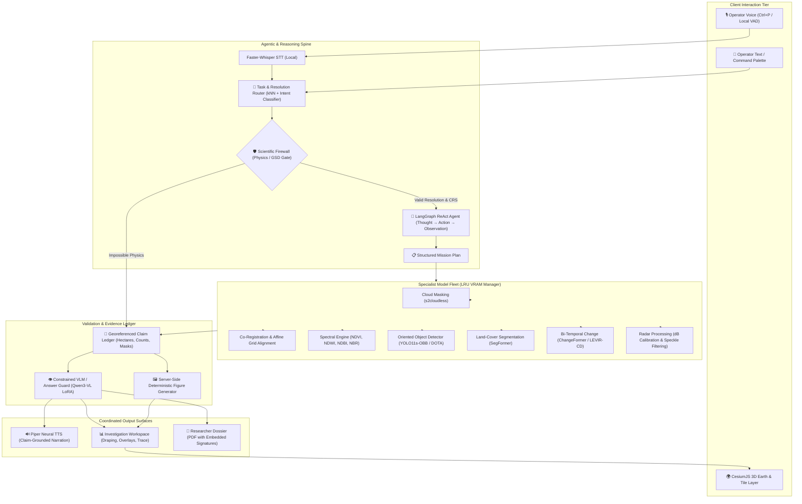

<div align="center">

```
   █████╗ ███████╗██████╗ ██╗███████╗
  ██╔══██╗██╔════╝██╔══██╗██║██╔════╝
  ███████║█████╗  ██████╔╝██║███████╗
  ██╔══██║██╔══╝  ██╔══██╗██║╚════██║
  ██║  ██║███████╗██║  ██║██║███████║
  ╚═╝  ╚═╝╚══════╝╚═╝  ╚═╝╚═╝╚══════╝
```

# 🛰️ AERIS — Autonomous Earth Reasoning & Intelligence System
### *Agentic Vision-Language Assistant & Multi-Specialist Earth Observation Intelligence Platform*

[](https://www.python.org/)
[](https://nextjs.org/)
[](https://cesium.com/)
[](https://pytorch.org/)
[](https://langchain.com/)
[](https://postgis.net/)
[](https://redis.io/)
[](https://min.io/)
[](LICENSE)

<br/>

[🌟 Overview](#-the-core-problem--the-aeris-solution) •
[🏛️ Architecture](#-system-architecture) •
[📦 Tech Stack](#-technology-stack) •
[🎯 Analysis Pillars](#-the-three-analysis-pillars) •
[🖥️ Workspaces](#-seven-integrated-workspaces) •
[⚡ Quickstart: Backend](#-backend-quickstart) •
[🌐 Quickstart: Frontend](#-frontend-quickstart) •
[📋 CLI Reference](#-cli-command-suite)

</div>

---

## 💡 The Core Problem & The AERIS Solution

> 🚨 **CRITICAL INSIGHT:** **Remote-sensing analysis today is a toolchain problem, not an algorithm problem.**
>
> Answering a seemingly simple question like *"Has the built-up area expanded around Mumbai between 2023 and 2026?"* forces an analyst to locate sensor data, download gigabytes of raw optical/SAR tiles, perform cloud masking, orthorectification, co-registration, select specialized computer vision models, calculate georeferenced pixel areas, and manually interpret disparate outputs.

### Why Generic Vision-Language Models (VLMs) Fail at Remote Sensing:
1. **Hallucination & Token Guessing:** Standard VLMs invent plausible-sounding answers with zero georeferenced grounding.
2. **Quantitative Blindness:** "How many hectares changed?" requires exact pixel counting on equal-area projections, not probabilistic next-token generation.
3. **Spectral Blindness:** Standard VLMs operate solely on 8-bit RGB; 13-band multispectral data (Sentinel-2), spectral indices (NDVI, NDWI, NDBI), and SAR complex polarimetry are invisible to them.
4. **Temporal & Cross-Modal Collapse:** Temporal change detection and Optical–SAR joint reasoning require strict sub-pixel alignment and sensor-specific physics.
5. **No Provenance or Auditability:** Defense, disaster response, and urban planning demand mathematical proofs and verifiable execution graphs.

### The AERIS Innovation: Autonomous Agentic Intelligence
**AERIS (SatQuery AI)** replaces fragmented toolchains with an **autonomous, multimodal Earth Observation copilot**. It pairs a **ReAct Agent** with a **hard Scientific Firewall**:
- **Autonomy Over Strategy, Zero Authority Over Science:** The agent formulates execution plans, but remote sensing physics governs execution.
- **Evidence-First Answers:** Every claim links directly to georeferenced spatial masks, bounding boxes, sensor metadata, model confidence, and verifiable trace steps.
- **Three Coordinated Surfaces:** Answers are delivered **Written** (exact claims & numbers), **Spoken** (offline, local neural voice loop with barge-in interruption), and **Shown** (server-rendered figures, colourised ramps, and interactive 3D Cesium globe).

---

## 📦 Technology Stack

<div align="center">

| Domain | Technologies & Frameworks | Highlights / Role |
| :--- | :--- | :--- |
| **Frontend & UI** |       | Next.js 16 App Router, Shadcn/Radix components, Framer Motion animations, Command Palette bus. |
| **3D Geospatial Engine** |    | WebGL 3D Earth Globe, dynamic COG XYZ tile draping, interactive vector overlays, node-graph execution trace. |
| **Backend Core & API** |      | Strict coroutine async architecture (`async def`), typed Pydantic boundaries, dual CLI + HTTP/SSE adapters. |
| **Agent & Orchestration** |    | State-machine ReAct loop, checkpointed pause/resume, custom event streaming, durable retries. |
| **Geospatial & Rasters** |      | Equal-area pixel calculations, COG streaming, Planetary Computer STAC search, windowed IO, s2cloudless. |
| **Specialist AI Fleet** |      | Multi-model LRU fleet manager, 8GB-to-24GB VRAM profiles, 4-bit quantized VLM with BigEarthNet LoRA, OBB detector. |
| **Voice & Speech (Local)** |    | 100% offline, local neural speech-to-text, real-time voice activity detection, and zero-latency audio synthesis. |
| **Infrastructure & Data** |     | Containerized local cloud stack, spatial indexing, GPU locking, S3 asset storage, and vector geometries. |

</div>

---

## 🏛️ System Architecture

AERIS bridges user intention to raw sensor photons through a 20-stage observable pipeline governed by physics:



---

## 🎯 The Three Analysis Pillars

```
┌─────────────────────────────────┬─────────────────────────────────┬─────────────────────────────────┐
│     SINGLE-IMAGE INTEL          │      TEMPORAL INTEL             │      CROSS-MODAL INTEL          │
├─────────────────────────────────┼─────────────────────────────────┼─────────────────────────────────┤
│ • Natural-Language VQA          │ • Bi-Temporal Change Detection  │ • Optical + SAR Late Fusion     │
│ • Text-Guided Grounding (REC)   │ • ChangeFormer (LEVIR-CD)       │ • All-Weather Structural SAR    │
│ • YOLO11s-OBB Object Detection  │ • Sub-Pixel Co-Registration     │ • Multispectral Optical Bands   │
│ • SegFormer Land Cover Classes  │ • Nominal Area In Hectares      │ • Dual-Sensor Disagreement Log  │
│ • Spectral Indices (NDVI, NDWI) │ • Before / After Spatial Mask   │ • Terrain Relief Shadow Masking │
│ • Cloud Screening (s2cloudless) │ • Temporal Trend Analysis       │ • Calibrated Backscatter (dB)   │
└─────────────────────────────────┴─────────────────────────────────┴─────────────────────────────────┘
```

1. **Single-Image Intelligence:** Answers queries on high-resolution optical, multispectral, or SAR scenes. Computes radiometric indices (`(B08 - B04)/(B08 + B04)`), isolates unhealthy vegetation, detects oriented infrastructure (ships, bridges, storage tanks), and classifies land-cover.
2. **Temporal Intelligence:** Evaluates time-separated scene pairs (T0 vs T1). Verifies affine-grid alignment, estimates transformation residuals, runs Siamese transformers to generate change masks, and calculates exact changed area in hectares with a 90%+ confidence score.
3. **Cross-Modal Intelligence:** Couples Sentinel-2 (Optical) and Sentinel-1 (C-band SAR) or Cartosat-2S and RISAT. SAR penetrates clouds and reveals structural density; optical reveals spectral signatures. Disagreements trigger confidence-null flags requesting a 3rd observation rather than guessing.

---

## 🖥️ Seven Integrated Workspaces

AERIS features a high-density, mission-grade frontend built for operational clarity:

| Workspace | Route | Purpose & Key Features |
| :--- | :--- | :--- |
| **Mission Command Center** | `/` | 3D Cesium Earth globe, live scene discovery via Planetary Computer STAC, quick telemetry, and instant natural language command execution. |
| **Investigation Workspace** | `/investigation` | Primary operational workbench: dual-split before/after comparator, vector overlay toggles, live S1–S20 node trace, and conversational ReAct panel. |
| **Evidence Explorer** | `/evidence` | Inspect every scientific claim, georeferenced bounding box, raster mask, model confidence percentage, and cryptographic provenance hash. |
| **Model Observatory** | `/models` | Real-time fleet telemetry: inspect active GPU models, VRAM allocation, queue depth, warm-up latency, and automatic LRU evictions. |
| **Figures & Diagnostic Lab** | `/figures` | Deterministic server-rendered figures with calibrated color ramps, histograms, dB backscatter slices, and threshold plots. |
| **Projects & Monitoring** | `/projects` | Save active investigations as repeatable monitoring missions with threshold-based AOI alerts (deforestation, urban sprawl). |
| **Detached Scene Viewer** | `/scene/[id]` | Lightweight high-speed single-scene inspection outside the 3D WebGL loop for rapid pixel-level examination. |

---

## ⚡ Backend Quickstart

Follow these steps to initialize and run the AERIS backend engine on a fresh machine.

### Prerequisites
- **Python:** 3.14.x (verified CPython)
- **uv:** Lightning-fast Python package installer & resolver ([Install Guide](https://docs.astral.sh/uv/getting-started/installation/))
- **Docker Desktop:** Running with Docker Compose support
- **CUDA:** 12.x / 13.0 (Optional; auto-falls back to CPU if no NVIDIA GPU is detected)

```bash
# 1. Install uv (PowerShell on Windows)
powershell -ExecutionPolicy ByPass -c "irm https://astral.sh/uv/install.ps1 | iex"

# Or macOS / Linux
curl -LsSf https://astral.sh/uv/install.sh | sh
```

### Installation Steps

```bash
# Step 1: Navigate to the backend directory
cd backend

# Step 2: Sync dependencies (creates .venv and installs locked dependencies)
uv sync

# Step 3: Activate the virtual environment
# Windows (PowerShell):
.venv\Scripts\activate
# macOS/Linux (Bash):
source .venv/bin/activate

# Step 4: Configure environment variables
# Windows:
Copy-Item .env.example -Destination .env
# macOS/Linux:
cp .env.example .env

# Step 5: Launch local containerized cloud infrastructure
docker compose up -d

# Step 6: Apply PostGIS database schema migrations
uv run alembic upgrade head

# Step 7: Run system diagnostics to verify all connections
uv run aeris doctor
```

> 💡 **Pro Tip:** When `uv run aeris doctor` outputs **ALL OK** across PostgreSQL/PostGIS, Redis, MinIO S3, and Inngest, your backend is 100% operational!

### Running the Backend Server (HTTP / WebSockets API)
To start the FastAPI serving layer for the frontend:

```bash
uv run uvicorn app.main:app --host 0.0.0.0 --port 8000 --reload
```
API Documentation will be live at: `http://localhost:8000/docs`

---

## 🌐 Frontend Quickstart

The AERIS frontend is built with **Next.js 16**, **React 19**, and **CesiumJS**.

### Prerequisites
- **Node.js:** v20.x or higher
- **pnpm:** v10.x recommended (`npm install -g pnpm`)

### Installation Steps

```bash
# Step 1: Navigate to the frontend directory
cd frontend

# Step 2: Install dependencies (automatically sets up Cesium static assets)
pnpm install

# Step 3: Configure environment variables
# Windows:
Copy-Item .env.example -Destination .env.local
# macOS/Linux:
cp .env.example .env.local

# Step 4: (Optional) Add your Cesium Ion Token in .env.local for high-res terrain
# NEXT_PUBLIC_CESIUM_ION_TOKEN=your_token_here

# Step 5: Start the development server
pnpm dev
```

Open [http://localhost:3000](http://localhost:3000) in your browser.

---

## 🐳 Infrastructure & Port Allocation

When running `docker compose up -d`, the following services are bound to `127.0.0.1`:

| Service | Container Port | Host Port | Role | Dashboard / Health URL |
| :--- | :--- | :--- | :--- | :--- |
| **PostGIS 3.5 (Postgres 17)** | `5432` | `5433` | Geospatial vector database & state store | `localhost:5433` (`aeris` / `aeris_local_development`) |
| **Redis 8.2** | `6379` | `6379` | GPU locking & LRU inference caching | `redis-cli ping` |
| **MinIO S3** | `9000` / `9001` | `9000` / `9001` | Cloud-Optimized GeoTIFFs & Figures | Web Console: `http://localhost:9001` |
| **TiTiler** | `80` | `8080` | Dynamic EPSG:3857 Web Mercator Tile Server | `http://localhost:8080/healthz` |
| **Inngest Dev Server** | `8288` | `8288` | Durable background retries & event hub | Web UI: `http://localhost:8288` |
| **FastAPI Backend** | `8000` | `8000` | REST API, SSE streams, Agent harness | Swagger Docs: `http://localhost:8000/docs` |
| **Next.js Frontend** | `3000` | `3000` | 3D WebGL Cesium & Investigation UI | Web App: `http://localhost:3000` |

---

## 📋 CLI Command Suite

AERIS exposes an autonomous remote sensing terminal interface via `aeris`:

```bash
# 🏥 System Health Verification
uv run aeris doctor

# 📊 End-to-End Multimodal Analysis
uv run aeris analyse --scene backend/data/datasets/sentinel2-l2a/mumbai_gate --level L2A --query "segment the buildings and compute area"

# 🔄 Bi-Temporal Change Detection
uv run aeris analyse --scene backend/data/datasets/levir-cd/test/B/0271.png --before backend/data/datasets/levir-cd/test/A/0271.png --gsd 0.5 --registered --query "what changed between the two dates"

# 🧠 Natural-Language Intent Routing & Resolution Check
uv run aeris route "how many ships are in the harbour" --gsd 0.5

# 🤖 Autonomous ReAct Agent Loop
uv run aeris agent "show me the water bodies, then map unhealthy vegetation and compute its area" --scene backend/data/datasets/sentinel2-l2a/mumbai_gate --level L2A --yes

# 🎙️ Local Offline Voice Session (Tony Stark / JARVIS mode)
uv run aeris voice --scene backend/data/datasets/sentinel2-l2a/mumbai_gate

# 🔭 Specialist Model Fleet Management
uv run aeris models status
uv run aeris models warm changeformer segformer-landcover --budget 700

# 📥 Acquire Satellite Scenes via Planetary Computer STAC
uv run aeris dataset fetch sentinel2-l2a --bbox 72.8,19.0,72.9,19.1 --from 2026-03-22 --to 2026-03-23 --clip --name mumbai_2026
```

---

## 🧪 Test Suite & Verification

Every component in AERIS is tested against deterministic mathematical assertions:

```bash
# Run backend test suite (unit + domain tests)
cd backend
uv run pytest

# Run integration tests (requires docker compose up -d)
uv run pytest -m integration

# Run code style & linting gates
uv run ruff check .

# Run frontend test suite
cd ../frontend
pnpm test
```

---

## 👥 Authors & Acknowledgments

Developed with dedication for the **Smart India Hackathon (SIH)**.
- **Problem Statement:** Multimodal Remote Sensing Assistant with Agentic Orchestration and Cross-Modal Vision-Language Adaptation.
- **Inspirations & Benchmarks:** BigEarthNet, LEVIR-CD, DOTA, RSVQA, VRSBench, and ESA Copernicus Sentinel missions.

---

<div align="center">

**AERIS — Because Earth Observation Demands Evidence, Not Assumptions.**

</div>
