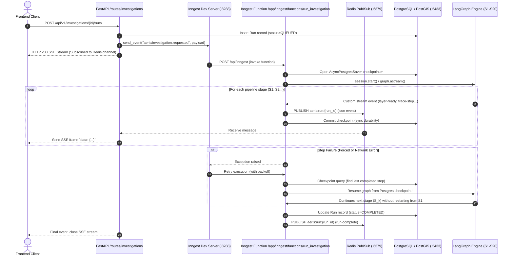

# Phase 2.5 Inngest Binding & Postgres Checkpointing — Design Document

**Date:** 2026-09-19  
**Status:** Approved (Approach 1)  
**Authors:** Parent Planner & Senior Backend Architect  

---

## 1. Context & Objectives

In Phase 1 and early Phase 2, AERIS established:
- **LangGraph Spine**: 20-stage pipeline with typed `StateGraph` and checkpointing.
- **Phase 1 Durability**: In-process `AsyncSqliteSaver` writing to `data/checkpoints.sqlite`.
- **FastAPI Serving & Voice**: REST endpoints, SSE streams, and bidirectional WebSocket audio transport.

According to **ADR-002** (`backend/bcontext/architecture-decisions.md`) and the **Roadmap** (`backend/bcontext/roadmap.md` §2.5):
> *\"One Inngest function wraps one graph invocation. Inngest guarantees the run happens and is retryable; LangGraph knows what the run is and where it got to. On an Inngest retry the graph resumes from its last checkpoint rather than re-executing completed nodes. The graphs do not change; the checkpointer moves from SQLite to Postgres.\"*

### Primary Goals
1. **Postgres Checkpointer**: Migrate LangGraph checkpointer from SQLite to Postgres (`AsyncPostgresSaver` via `langgraph-checkpoint-postgres`) utilizing the existing PostgreSQL/PostGIS database.
2. **Inngest Binding**: Create `app/inngest/functions/` and register:
   - `run_investigation`: Triggered by `aeris/investigation.requested`.
   - `ingest_scene`: Triggered by `aeris/scene.ingest_requested`.
3. **Inngest Serving Endpoint**: Mount Inngest handler on FastAPI at `/api/inngest` via `inngest.fast_api.serve`.
4. **Redis Pub/Sub Stream Fan-out**: Decouple durable worker execution from client HTTP connections:
   - Worker publishes stream events to Redis channel `aeris:run:<run_id>`.
   - `GET /api/v1/investigations/{id}/runs` subscribes to Redis channel and streams SSE events to the browser.
5. **Durable Retry Verification (The Phase 2.5 Gate)**:
   - Prove an interrupted or failed run retries and resumes from its checkpoint in Postgres rather than from the beginning ($S_1$).

---

## 2. Architecture & Component Interaction



---

## 3. Detailed Component Design

### 3.1 Checkpointer Migration (`backend/app/services/pipeline/checkpointer.py`)
- Add `langgraph-checkpoint-postgres` dependency.
- Define `open_checkpointer()`:
  - If `settings.database_url` is configured and Postgres is available, connects to Postgres via `AsyncPostgresSaver.from_conn_string(conn_string)`.
  - Calls `await checkpointer.setup()` on startup to ensure `checkpoints`, `checkpoint_blobs`, and `checkpoint_writes` tables exist.
  - Falls back to `AsyncSqliteSaver` only when offline without Postgres container.
- Update `read_thread_state()` and `read_state_for_step()` to support the Postgres saver.

### 3.2 Inngest Client & Event Vocabulary (`backend/app/constants/tasks.py` & `app/lib/inngest.py`)
- Update `EventName` in `app/constants/tasks.py`:
  ```python
  class EventName(StrEnum):
      HEALTH_PROBE = "aeris/system.health-probed"
      INVESTIGATION_REQUESTED = "aeris/investigation.requested"
      SCENE_INGEST_REQUESTED = "aeris/scene.ingest_requested"
  ```
- Update `app/lib/inngest.py`:
  - Provide `get_inngest_app()` or export initialized `inngest_client`.

### 3.3 Inngest Functions Package (`backend/app/inngest/`)
- `backend/app/inngest/__init__.py`: Package root.
- `backend/app/inngest/functions/__init__.py`: Registry of all Inngest functions.
- `backend/app/inngest/functions/run_investigation.py`:
  - Trigger: `event: EventName.INVESTIGATION_REQUESTED`
  - Retries: `retries=3`
  - Function body:
    - Extracts `run_id`, `investigation_id`, `query`, `graph_name`, `extra_state`.
    - Compiles graph with `AsyncPostgresSaver`.
    - Attaches `RedisEventPublisher` to `fanout`.
    - Awaits `session.wait()`.
    - Updates `DbRun` status in Postgres upon completion or terminal error.
- `backend/app/inngest/functions/ingest_scene.py`:
  - Trigger: `event: EventName.SCENE_INGEST_REQUESTED`
  - Retries: `retries=3`
  - Implements durable download, Cloud-Optimized GeoTIFF (COG) generation, and metadata extraction.

### 3.4 FastAPI Inngest Handler (`backend/app/main.py`)
- Call `inngest.fast_api.serve(app, client=get_client(), functions=inngest_functions)` to mount the webhook at `/api/inngest`.

### 3.5 Redis Pub/Sub Stream Bridge (`backend/app/services/sessions/redis_stream.py`)
- `RedisEventPublisher`: Implements the fan-out subscriber interface, serializing `AnalysisStreamEvent` models and publishing them to `f"aeris:run:{run_id}"`.
- `redis_event_subscriber(run_id: str) -> AsyncIterator[AnalysisStreamEvent]`: Subscribes to `f"aeris:run:{run_id}"` using `app.lib.redis.get_client()`, yielding parsed events until `run-complete` or `run-error` is received.

### 3.6 Route Integration (`backend/app/routes/investigations.py` & `run_service.py`)
- `run_service.start_investigation_run()`:
  - Inserts `DbRun` record in Postgres with status `QUEUED`.
  - Dispatches `aeris/investigation.requested` event via `send_event()`.
  - Returns `(run_id, redis_event_subscriber(run_id))`.

---

## 4. Verification & Testing Strategy

1. **Checkpointer Postgres Unit/Integration Tests**:
   - Verify `AsyncPostgresSaver` creates tables, persists checkpoints across processes, and restores full thread state.
2. **Inngest Function Integration Tests**:
   - `tests/integration/inngest/test_run_investigation.py`:
     - Test function invocation via event.
     - Test forced step failure: inject failure at step 2, verify Inngest retry resumes from checkpoint in Postgres and skips step 1.
3. **End-to-End SSE via Redis Test**:
   - Verify `POST /api/v1/investigations/{id}/runs` emits event to Inngest, executes via worker, streams across Redis Pub/Sub, and delivers complete SSE events to the HTTP response.
4. **Git Hygiene**:
   - Ensure all changes remain unstaged and uncommitted. Zero git commits.
