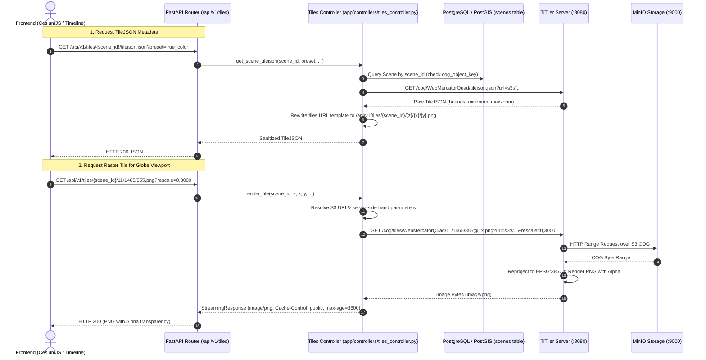

# Phase 2.6 Tiles & TiTiler Service Promotion — Design Document

**Date:** 2026-09-19  
**Status:** Approved (Approach 1)  
**Authors:** Senior Backend Architect & Planner  

---

## 1. Context & Objectives

In Phase 1.2, TiTiler was integrated into `docker-compose.yml` (`aeris-titiler` running on port 8080) and validated as an isolated gate over raw S3 COGs in MinIO (`s3://aeris-cog/...`).

According to **roadmap.md** (§2.6):
> *"TiTiler promoted from the 1.2 gate to a supported service; band selection and stretch via query params. Band math is server-side; the browser never does it."*

And **api-contract.md** (§8):
1. **XYZ in EPSG:3857 (WebMercatorQuad)** — TiTiler's default.
2. **CORS is mandatory** — Cesium fetches tiles cross-origin onto a canvas WebGL texture.
3. **Alpha channel required** — PNG with transparency, so nodata is transparent.
4. **Send bounds, minzoom, maxzoom** — Carried in TileJSON to prevent Cesium from collecting planet-wide 404s.
5. **Band selection and stretch stay server-side** — Via query parameters (`bands`, `rescale`, `colormap_name`, `expression`). The browser must never perform band math.

### Primary Goals of Phase 2.6
1. **First-Class `/api/v1/tiles` API Endpoint**:
   - `GET /api/v1/tiles/{scene_id}/tilejson.json`:
     Resolves scene COG in PostgreSQL/MinIO, queries TiTiler for WebMercatorQuad TileJSON, rewrites tile URLs to point through the AERIS API, and delivers bounds, minzoom, and maxzoom.
   - `GET /api/v1/tiles/{scene_id}/{z}/{x}/{y}.png` (and `.webp`):
     Streams 256x256 Web Mercator PNG tiles with alpha transparency directly from TiTiler, accepting server-side band selection, contrast stretch, colormaps, and presets.
   - `GET /api/v1/tiles/{scene_id}/preview`:
     Returns an instant rendered image preview of the scene.
2. **Preset Registry & Server-Side Band Math**:
   - Provide standard presets: `true_color` (RGB), `false_color_nir` (NIR-R-G), `ndvi` (Normalized Difference Vegetation Index), `ndwi` (Normalized Difference Water Index), `sar_amplitude` (for radar scenes).
   - Server-side translation into TiTiler parameters (`bidx`, `rescale`, `colormap_name`, `expression`).
3. **Integration with Investigation & Pipeline Serving**:
   - Ensure `investigation_service.py`'s `AcquisitionTiles` resolves real tile templates (`/api/v1/tiles/{scene_id}/{z}/{x}/{y}.png`).
   - Ensure `lib/tiles.py` provides helpers for building proxy URLs or direct TileJSON descriptors.
4. **Zero Client Leakage**:
   - Internal `s3://` storage paths, MinIO credentials, and raw container ports remain hidden behind the FastAPI gateway.

---

## 2. Architecture & Request Flow



---

## 3. Detailed Component Specifications

### 3.1 Preset Registry (`backend/app/constants/presets.py`)
Defines server-side visualization configurations:
```python
class BandPreset(StrEnum):
    TRUE_COLOR = "true_color"           # Optical B4, B3, B2
    FALSE_COLOR_NIR = "false_color_nir" # Optical B8, B4, B3
    NDVI = "ndvi"                       # (B8 - B4) / (B8 + B4)
    NDWI = "ndwi"                       # (B3 - B8) / (B3 + B8)
    SAR_VV = "sar_vv"                   # Single band SAR amplitude
```
Maps presets to TiTiler query parameters:
- `true_color`: `bidx=4,3,2&rescale=0,3000` (or `bidx=1,2,3` for RGB scenes).
- `false_color_nir`: `bidx=8,4,3&rescale=0,3500`.
- `ndvi`: `expression=(b8-b4)/(b8+b4)&rescale=-0.2,0.8&colormap_name=rdylgn`.
- `sar_vv`: `bidx=1&rescale=0,0.5&colormap_name=gray`.

### 3.2 Tiles Route & Controller (`backend/app/routes/tiles.py`, `backend/app/controllers/tiles_controller.py`)
- **Route Declaration (`routes/tiles.py`)**:
  - `GET /tiles/{scene_id}/tilejson.json`
  - `GET /tiles/{scene_id}/{z}/{x}/{y}.png`
  - `GET /tiles/{scene_id}/preview`
  - Conforms to `folder-archtecture.md`: Pure routing logic, delegating execution to `tiles_controller`.
- **Controller Logic (`controllers/tiles_controller.py`)**:
  - Verifies scene existence and `cog_object_key` in Postgres.
  - Derives `s3://aeris-cog/...` or `s3://aeris-raw/...` URI.
  - Queries TiTiler asynchronously using persistent `httpx.AsyncClient` session.
  - Rewrites TileJSON `tiles` array to point to `/api/v1/tiles/{scene_id}/{z}/{x}/{y}.png`.
  - Streams binary response with proper Content-Type (`image/png`) and cache headers (`Cache-Control: public, max-age=3600`).

### 3.3 Tiles Library (`backend/app/lib/tiles.py`)
- Updated to support both local proxy templates (`/api/v1/tiles/{scene_id}/{z}/{x}/{y}.png`) and TiTiler direct URLs.
- Helper `build_tile_url_template(scene_id, preset=..., **kwargs)`.

---

## 4. Verification & Testing Plan

1. **Integration Tests (`backend/tests/integration/api/test_tiles.py`)**:
   - `test_get_tilejson_for_existing_scene`: Verify `bounds`, `minzoom`, `maxzoom`, and rewritten tile URL template.
   - `test_get_tilejson_for_missing_scene`: Returns 404 with standard `ResourceNotFoundError` JSON shape.
   - `test_get_tile_png_with_alpha`: Requests `{z}/{x}/{y}.png` and confirms image is valid RGBA PNG with alpha channel over nodata.
   - `test_get_tile_with_presets_and_stretch`: Confirms `preset=ndvi` or `rescale=0,1` is translated and passed to TiTiler without error.
   - `test_get_tile_preview`: Confirms preview image loads.
2. **CORS & Alpha Integrity**:
   - Assert `Access-Control-Allow-Origin` permits frontend origin.
   - Assert nodata remains fully transparent.
3. **End-to-End Live Verification**:
   - Verify against running backend on port 8000 and running TiTiler container on port 8080.
